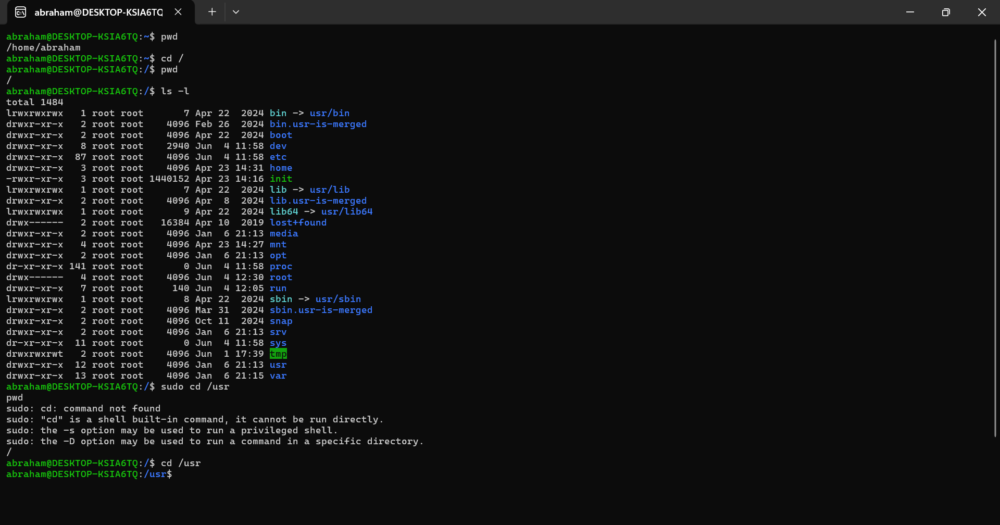

# Basic-Linux-Commands
# Linux Commands Deep Dive

## Project Overview
This project explores Linux commands on an AWS EC2 Ubuntu server, focusing on file and directory manipulation using commands like `sudo`, `mkdir`, `cd`, `pwd`, `ls`, `cat`, `cp`, `mv`, `rm`, `touch`, and `find`. A side task involved creating nested directories.

## Steps Taken

### Setup
- Used my local Ubuntu terminal via WSL to practice Linux commands, as the tasks don’t require a cloud server.


### Exploring Linux Commands
- **Using `sudo` to Create a Folder**:
- Attempted to create a folder in `/root`:
  ```
  mkdir /root/example
  ```
  - Failed with “Permission denied.”
- Used `sudo` to create it:
  ```
  sudo mkdir /root/example
  ```
- Verified with:
  ```
  sudo ls /root
  ```
- **Screenshot**: Folder creation:

  

- **Navigating with `pwd` and `cd`**:
- Checked current directory:
  ```
  pwd
  ```
  - Output: `/home/abraham`.
- Navigated to `/` and `/usr`:
  ```
  sudo cd /
  sudo cd /usr
  pwd
  ```
  - Output: `/usr`.




### Side Hustle Task 1
- Created `/usr/photos`:
- Navigated into it and created 3 directories:
- Output: `birthday  vacation  wedding`.
- Navigated into `vacation` and showed the path:
- Output: `/usr/photos/vacation`.
- **Screenshot**: Side task steps:


### Other Commands
- **List Files**: `ls -lh /home/abraham`.


- **View File Content**: `cat abraham2-ec2.pem`.
- **Screenshot**: abraham-ec2.pem:

 


- **Copy Files**: `cp /home/abraham/test.txt /home/ubuntu/test_copy.txt`.
- **Move/Rename**: `mv /home/abraham/test_copy.txt /home/ubuntu/renamed_test.txt`.
- **Remove**: `rm /home/abraham/renamed_test.txt`.
- **Create File**: `touch /home/abraham/newfile.html`.
- **Find File**: `find /home -name newfile.html`.


## Tools Used
- **Ubuntu Terminal (WSL)**: For executing Linux commands locally.
- **Git Bash**: For submitting documentation to GitHub.
- **VS Code**: For creating this documentation.
- **GitHub**: For hosting the documentation.
## Lessons Learned
- `sudo` enables privileged operations like creating folders in restricted areas.
- Commands like `cd`, `pwd`, and `ls` are essential for navigation.
- File manipulation commands (`cp`, `mv`, `rm`) streamline workflows.

## Repository Link
[GitHub Repository](https://github.com/westgrin/Basic-Linux-Commands)

## Conclusion
This project deepened my understanding of Linux commands, enhancing my ability to manage files and directories on a server.

